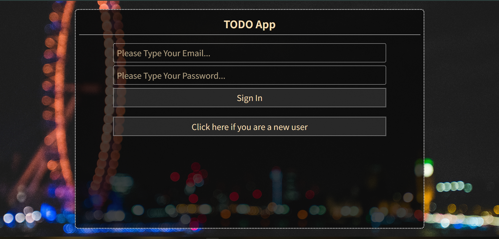

link to repo -- https://github.com/sahaarnav3/express-todolist.git

Trying to create a todolist using express and this list will work according to the signed in user i.e a seperate instance of task list for all different users. And since it is using mongoDB a user can login from any device to continue the session from where he left.

# LOGIN SCREEN 

As you can see the login screen has both functionality to either login directly if user already exists, if not then he can create a new id with the respective button.

