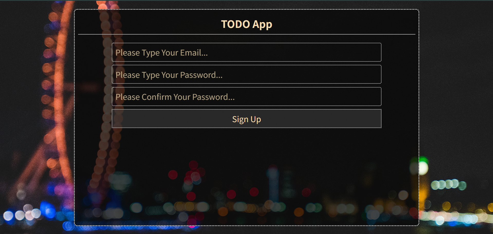
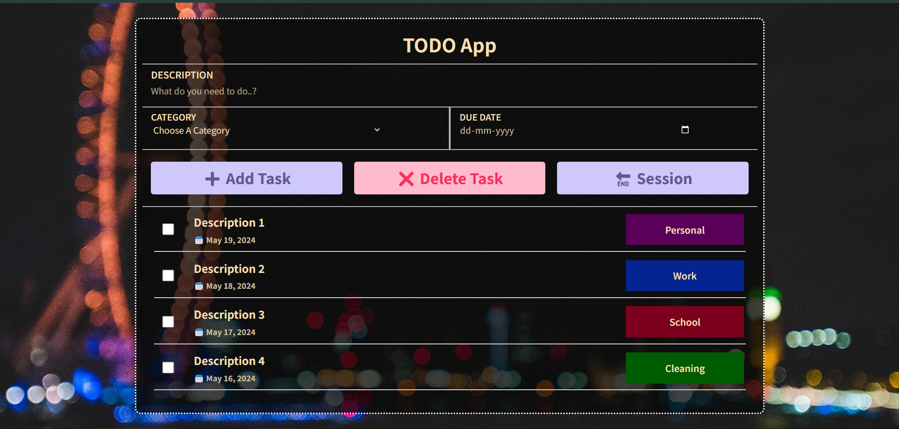

link to repo -- https://github.com/sahaarnav3/express-todolist.git

Trying to create a todolist using express and this list will work according to the signed in user i.e a seperate instance of task list for all different users. And since it is using mongoDB a user can login from any device to continue the session from where he left.

# LOGIN SCREEN 

As you can see the login screen has both functionality to either login directly if user already exists, if not then he can create a new id with the respective button.

# CREATE NEW USER SCREEN

As you can see it contains 3 input sections -- email, password and confirm password. They all work as they should.

# HOME PAGE

This is main home page that will show up after a user logs in. As you see there are 3 sections -- Input section, Button section and finally the Task Section.

The buttons are self explanatory, add task will add the task to the list. You can delete single or multiple tasks at once. You just need to select the respective tasks that you want deleted and then press delete button. And thirdly the end session button is for logging the user out of the app; the defualt cookie age currently is around 100 minutes.

# Modules Used --
 cookie-parser, express-ejs-layouts, mongoose, express-session, passport (& passport-local)

# THANK YOU :-)
